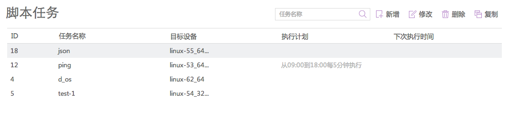
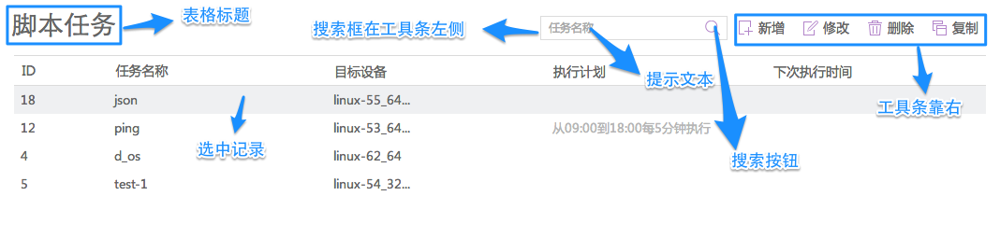

## 前端元素交互风格参考

### 表格页

- 基本元素：标题、搜索栏、过滤器、工具条、表头、表格内容区、分页组件、记录选择

#### 样例原图

#### 样例说明

### Form页

#### 标题
#### 工具条
#### Fieldset
#### 帮助提示
#### 样例

### Tab页

#### 标题

### 弹窗控件

#### 普通弹窗
#### Tab弹窗

### 选择器控件
- 目前用于设备、设备组、用户、用户组、系统账号的选择

#### 设备选择器
#### 其他选择器

### 元素关联控件
- 支持设备、设备组、用户、用户组、系统账号、访问规则、双人授权 的关联配置
- 支持"已关联、未关联、全部"列表及相关操作，支持搜索、分页
